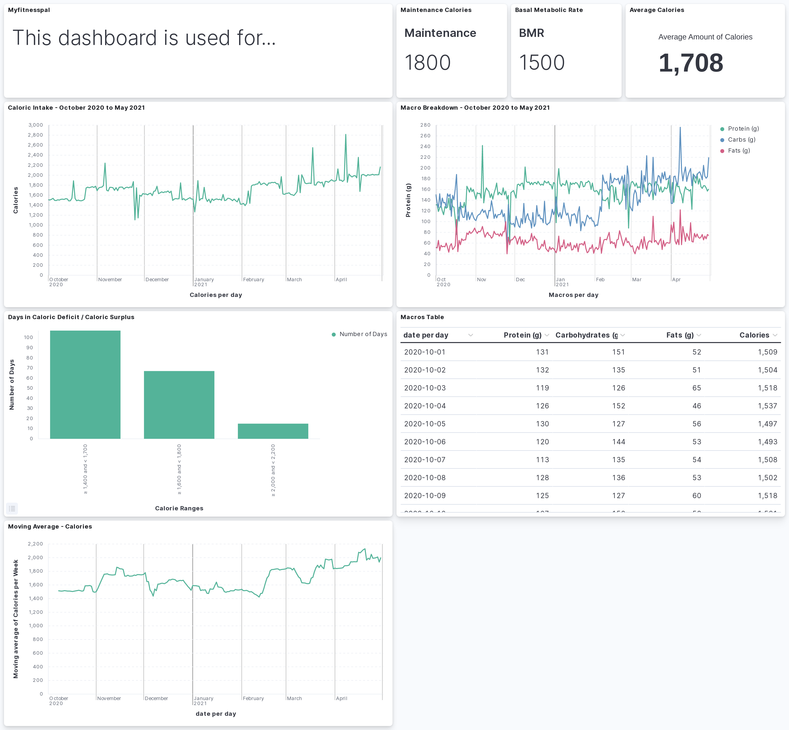

# This is used to send myfitnessal diary entries to Elasticsearch



## setup
### As outlined in python-myfitnesspal documentation(link), we first need to install the package
```
pip install myfitnesspal
```

### I also found it complained the typing extensions package was missing. If that happens, simply install that as well
```
pip install typing-extensions
```

### Since the myfitnesspal package uses cookies to log in from the terminal, we will have to grant the terminal full disk access. You can do this, by following the steps outlined here (link).

## Pass in desired date range

```
def main():

    start_date = date(2020, 10, 1)
    end_date = date(2020, 10, 2)

    delta = timedelta(days=1)
    dates = []
    while start_date <= end_date:
        dates.append(start_date.isoformat())
        start_date += delta

    parse_range_of_dates(dates)
```

## Store Results in JSON File
### First, create two separate json files 
### "macros_calories_overall.json" - to store total calories and macros for the day
### "meals_macros_calories.json" - to store calories and macros for each meal of that day
### Uncomment function calls in both output functions to send nutrition data to two seperate JSON files
### Quick note, remove last comma in json file and wrap entire output in braces to denote list of objects

```
def total_daily_macros_and_calories_output(date, daily_totals_dict):
    daily_total_dict = {
        'date': date,
        'daily_macros': daily_totals_dict
    }

    # send_todays_total_to_elasticsearch(daily_total_dict)
    send_todays_total_to_json_file(daily_total_dict)

def each_meals_macros_and_calories_output(breakfast_struct, lunch_struct, dinner_struct):
    breakfast_json_object = json.dumps(breakfast_struct)
    send_meals_to_json_file(breakfast_json_object)
    # send_meals_to_elasticsearch(breakfast_json_object)

    lunch_json_object = json.dumps(lunch_struct)
    send_meals_to_json_file(lunch_json_object)
    # send_meals_to_elasticsearch(lunch_json_object)

    dinner_json_object = json.dumps(dinner_struct)
    send_meals_to_json_file(dinner_json_object)
    # send_meals_to_elasticsearch(dinner_json_object)
```

## Send JSON to Elasticsearch and store as index
### To send data to ES, you will first need an Elastic Cloud account (link)
### steps to use Elasticsearch python client
### Finally, uncomment function calls in both output functions to send nutrition data to ES

```
def total_daily_macros_and_calories_output(date, daily_totals_dict):
    daily_total_dict = {
        'date': date,
        'daily_macros': daily_totals_dict
    }

    send_todays_total_to_elasticsearch(daily_total_dict)
    # send_todays_total_to_json_file(daily_total_dict)

def each_meals_macros_and_calories_output(breakfast_struct, lunch_struct, dinner_struct):
    breakfast_json_object = json.dumps(breakfast_struct)
    # send_meals_to_json_file(breakfast_json_object)
    send_meals_to_elasticsearch(breakfast_json_object)

    lunch_json_object = json.dumps(lunch_struct)
    # send_meals_to_json_file(lunch_json_object)
    send_meals_to_elasticsearch(lunch_json_object)

    dinner_json_object = json.dumps(dinner_struct)
    # send_meals_to_json_file(dinner_json_object)
    send_meals_to_elasticsearch(dinner_json_object)
```